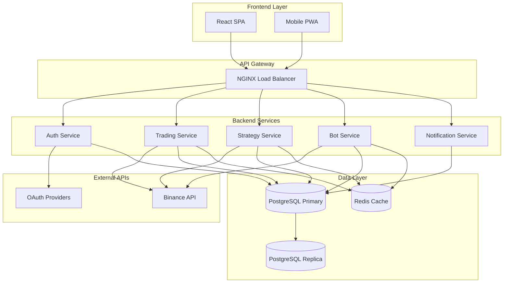

# CryptoTradeManager

> 🚀 **AI 기반 암호화폐 자동매매 및 분석 플랫폼**  
> Binance API 연동을 통한 실시간 거래 분석, 성과 평가, 자동매매 통합 솔루션

[](https://openjdk.org/projects/jdk/17/)
[](https://spring.io/projects/spring-boot)
[](https://www.postgresql.org/)
[](https://redis.io/)
[](https://www.docker.com/)
[](LICENSE)

---

## 📋 목차

- [🎯 프로젝트 소개](#-프로젝트-소개)
- [✨ 주요 기능](#-주요-기능)
- [🛠 기술 스택](#-기술-스택)
- [🏗 시스템 아키텍처](#-시스템-아키텍처)
- [🚀 설치 및 실행](#-설치-및-실행)
- [⚙️ 개발 환경 설정](#️-개발-환경-설정)
- [📖 API 문서](#-api-문서)
- [🤝 기여하기](#-기여하기)
- [📄 라이선스](#-라이선스)

---

## 🎯 프로젝트 소개

**CryptoTradeManager**는 암호화폐 트레이더의 거래 분석 및 성과 관리를 위한 통합 플랫폼입니다.  
Binance API 연동을 통해 실시간 거래 데이터를 수집하고, AI 기반 분석으로 매매 성과를 평가하며,  
전략 기반 자동매매를 제공하여 24/7 거래 기회를 활용할 수 있도록 지원합니다.

### 🎯 비즈니스 목표
- **주요 목표**: 암호화폐 트레이더의 거래 분석 및 성과 관리 효율성 향상
- **부가 목표**: AI 기반 매매 피드백을 통한 트레이딩 스킬 개선 지원  
- **확장 목표**: 자동매매를 통한 24/7 거래 기회 활용 및 체계적인 리스크 관리

---

## ✨ 주요 기능

### 🔐 사용자 관리 시스템
- **다중 인증 방식**: 이메일/비밀번호, 소셜 로그인 (Google, Apple), 2FA 지원
- **보안 강화**: JWT 토큰 기반 인증, 로그인 시도 제한, 세션 관리
- **프로필 관리**: 다국어 지원 (한글/영어), 시간대 설정, 개인화 옵션

### 📊 거래소 연동 시스템
- **Binance API 완전 연동**: REST API v3 + WebSocket 실시간 데이터
- **안전한 API 키 관리**: AES-256-GCM 암호화, AWS KMS 연동 지원
- **실시간 데이터 수집**: 가격, 거래량, 포지션 정보 자동 동기화
- **다중 계정 지원**: 여러 거래소 계정 동시 관리

### 📈 매매일지 관리 시스템  
- **거래 내역 완전 관리**: 자동 수집 + 수동 입력, 고급 필터링 및 검색
- **정확한 손익 계산**: 실현/미실현 손익, FIFO 방식 적용, 수수료 포함 계산
- **통계 분석**: 승률, 손익비, 샤프 비율, MDD (최대낙폭) 자동 계산
- **태그 및 메모**: 거래별 분류 및 노트 관리

### 🤖 AI 분석 시스템
- **성과 점수화**: 승률(40%) + 손익비(30%) + 리스크관리(20%) + 일관성(10%) 종합 평가
- **등급 시스템**: S~D 등급 (상위 5%~하위 순) 자동 산정
- **AI 피드백**: 거래 패턴 분석 및 개선점 제시
- **개인화된 조언**: 사용자별 트레이딩 스타일 분석 및 맞춤 권장사항

### 📋 전략 관리 시스템
- **기본 전략 제공**: RSI, 이동평균, MACD 등 검증된 기술적 지표 전략
- **백테스트 엔진**: 과거 2년 데이터 기반 전략 검증, 실제 수수료 적용
- **성과 지표**: 총수익률, 연환산수익률, 최대낙폭, 샤프비율 제공
- **전략 커스터마이징**: 사용자 정의 매개변수 및 조건 설정

### ⚡ 자동매매 시스템
- **다양한 주문 유형**: 시장가, 지정가, 조건부 주문 (Stop Loss/Take Profit)
- **고급 주문**: OCO, 아이스버그, 트레일링 스톱 지원
- **리스크 관리**: 포지션 사이징, 일일/월간 손실 한도 설정
- **다중 봇 운영**: 전략별 독립적 봇 운영, 실시간 모니터링

### 📊 실시간 대시보드
- **포트폴리오 현황**: 총 자산, 일간 수익률, 코인별 분산 현황
- **성과 위젯**: 실현손익, 승률, MDD, 활성 봇 현황 실시간 표시  
- **시장 정보**: 관심종목 가격, 비트코인 도미넌스, 공포탐욕지수
- **알림 시스템**: 거래 체결, 가격 변동, 봇 상태 변경 즉시 알림

---

## 🛠 기술 스택

### 🏗 Backend
| 기술 | 버전 | 용도 |
|------|------|------|
| **Java** | 17 | 메인 프로그래밍 언어 |
| **Spring Boot** | 3.5.4 | 백엔드 프레임워크 |
| **Spring Security** | 6.0+ | 인증 및 보안 |
| **Spring Data JPA** | - | 데이터베이스 ORM |
| **Lombok** | - | 코드 간소화 |

### 🗄 Database & Cache
| 기술 | 버전 | 용도 |
|------|------|------|
| **PostgreSQL** | 16 | 메인 데이터베이스 |
| **Redis** | 7.0 | 캐시 및 세션 저장 |

### 🌐 Frontend (계획)
| 기술 | 버전 | 용도 |
|------|------|------|
| **React** | 18 | 프론트엔드 프레임워크 |
| **TypeScript** | 4.9+ | 타입 안전성 |
| **Material-UI** | v5 | UI 컴포넌트 라이브러리 |
| **Redux Toolkit** | - | 상태 관리 |
| **Chart.js** | - | 차트 라이브러리 |

### 🏗 Infrastructure & DevOps
| 기술 | 용도 |
|------|------|
| **Docker** | 컨테이너화 |
| **Docker Compose** | 로컬 개발 환경 |
| **AWS** | 클라우드 인프라 (EC2, RDS, ElastiCache) |
| **GitHub Actions** | CI/CD |
| **Prometheus + Grafana** | 모니터링 |

### 🔌 External APIs
- **Binance REST API v3**: 거래소 데이터 조회 및 주문 실행
- **Binance WebSocket**: 실시간 가격 및 거래 데이터
- **Google OAuth 2.0**: 소셜 로그인
- **Apple Sign-In**: iOS 소셜 로그인

---

## 🏗 시스템 아키텍처



### 핵심 아키텍처 특징
- **마이크로서비스 아키텍처**: 도메인별 독립적 서비스 분리
- **이벤트 기반 아키텍처**: Redis Pub/Sub를 통한 실시간 이벤트 처리
- **CQRS 패턴**: 읽기/쓰기 분리로 성능 최적화
- **Circuit Breaker**: 외부 API 장애 시 서킷 브레이커 패턴 적용

---

## 🚀 설치 및 실행

### 📋 사전 요구사항

- **Java 17** 이상
- **Docker** 및 **Docker Compose** 
- **Git**
- **Binance API Key** (테스트용 계정 권장)

### 🔧 빠른 시작

1. **프로젝트 클론**
```bash
git clone https://github.com/yourusername/CryptoTradeManager.git
cd CryptoTradeManager
```

2. **환경 설정**
```bash
# .env 파일 생성 (템플릿 복사)
cp .env.example .env

# 필수 환경 변수 설정
# - DATABASE_URL
# - REDIS_URL  
# - BINANCE_API_KEY
# - BINANCE_SECRET_KEY
```

3. **Docker Compose로 실행**
```bash
# 데이터베이스 및 Redis 시작
docker-compose up -d postgres redis

# 애플리케이션 빌드 및 시작
./gradlew bootRun
```

4. **접속 확인**
```bash
# Health Check
curl http://localhost:8080/actuator/health

# API 문서
open http://localhost:8080/swagger-ui.html
```

### 🐳 Docker 완전 실행

```bash
# 전체 스택 실행 (애플리케이션 포함)
docker-compose up -d

# 로그 확인
docker-compose logs -f app

# 서비스 중지
docker-compose down
```

---

## ⚙️ 개발 환경 설정

### 📁 프로젝트 구조

```
src/
├── main/
│   ├── java/com/cryptotrademanager/
│   │   ├── auth/              # 사용자 인증 및 권한 관리
│   │   ├── exchange/          # 거래소 API 연동
│   │   ├── trading/           # 거래 내역 관리
│   │   ├── strategy/          # 전략 관리 및 백테스트
│   │   ├── bot/              # 자동매매 봇 엔진
│   │   ├── analysis/          # AI 분석 시스템
│   │   ├── dashboard/         # 대시보드 API
│   │   ├── notification/      # 알림 시스템
│   │   ├── audit/            # 감사 로깅
│   │   └── common/           # 공통 컴포넌트
│   └── resources/
│       ├── application.yml    # 메인 설정
│       ├── application-dev.yml
│       ├── application-prod.yml
│       └── db/migration/     # Flyway 마이그레이션
└── test/                    # 테스트 코드
```

### 🔧 IDE 설정 

#### IntelliJ IDEA 권장 설정
```bash
# Lombok 플러그인 설치 필수
# Settings > Build > Compiler > Annotation Processors > Enable annotation processing 체크

# Code Style 설정
# Settings > Code Style > Java > Import 
# - Use single class import
# - Class count to use import with '*': 999
# - Names count to use import with '*': 999
```

#### VS Code 설정
```json
{
  "java.configuration.runtimes": [
    {
      "name": "JavaSE-17",
      "path": "/path/to/jdk-17"
    }
  ],
  "java.compile.nullAnalysis.mode": "automatic",
  "spring-boot.ls.problem.application-properties.enabled": true
}
```

### 🗄 데이터베이스 설정

#### 로컬 PostgreSQL 설치 (선택사항)
```bash
# macOS
brew install postgresql
brew services start postgresql
createdb cryptotrademanager

# Ubuntu
sudo apt-get install postgresql postgresql-contrib
sudo service postgresql start
sudo -u postgres createdb cryptotrademanager
```

#### Redis 설치 (선택사항)
```bash
# macOS  
brew install redis
brew services start redis

# Ubuntu
sudo apt-get install redis-server
sudo service redis-server start
```

### ⚙️ 환경 변수 설정

```env
# .env 파일 예시
DATABASE_URL=jdbc:postgresql://localhost:5432/cryptotrademanager
DATABASE_USERNAME=your_db_user
DATABASE_PASSWORD=your_db_password

REDIS_URL=redis://localhost:6379
REDIS_PASSWORD=

BINANCE_API_URL=https://api.binance.com
BINANCE_API_KEY=your_binance_api_key
BINANCE_SECRET_KEY=your_binance_secret_key

JWT_SECRET=your-super-secret-jwt-key-at-least-256-bits
JWT_EXPIRATION=3600

OAUTH_GOOGLE_CLIENT_ID=your_google_client_id
OAUTH_GOOGLE_CLIENT_SECRET=your_google_client_secret

NOTIFICATION_EMAIL_SMTP_HOST=smtp.gmail.com
NOTIFICATION_EMAIL_USERNAME=your_email@gmail.com
NOTIFICATION_EMAIL_PASSWORD=your_app_password

LOG_LEVEL=INFO
ACTUATOR_ENABLED=true
```

---

## 📖 API 문서

### 🌐 Swagger UI
개발 서버 실행 후 다음 URL에서 API 문서를 확인할 수 있습니다:

- **Local**: http://localhost:8080/swagger-ui.html
- **API Docs JSON**: http://localhost:8080/v3/api-docs

### 🔑 주요 API 엔드포인트

#### 인증 API
```http
POST   /api/v1/auth/register     # 회원가입
POST   /api/v1/auth/login        # 로그인  
POST   /api/v1/auth/refresh      # 토큰 갱신
POST   /api/v1/auth/logout       # 로그아웃
```

#### 거래 내역 API
```http
GET    /api/v1/trades            # 거래 내역 조회
POST   /api/v1/trades            # 수동 거래 등록
PUT    /api/v1/trades/{id}       # 거래 내역 수정
DELETE /api/v1/trades/{id}       # 거래 내역 삭제
```

#### 자동매매 봇 API
```http
GET    /api/v1/bots              # 봇 목록 조회
POST   /api/v1/bots              # 봇 생성
POST   /api/v1/bots/{id}/start   # 봇 시작
POST   /api/v1/bots/{id}/stop    # 봇 정지
GET    /api/v1/bots/{id}/status  # 봇 상태 조회
```

#### 전략 관리 API
```http
GET    /api/v1/strategies        # 전략 목록
POST   /api/v1/strategies        # 전략 생성
POST   /api/v1/strategies/{id}/backtest  # 백테스트 실행
```

### 🔌 WebSocket API

#### 실시간 데이터 구독
```javascript
// 연결
const ws = new WebSocket('wss://api.cryptotrademanager.com/ws?token=jwt_token');

// 포트폴리오 실시간 업데이트 구독
ws.send(JSON.stringify({
  action: 'subscribe',
  channel: '/topic/portfolio/{user_id}'
}));

// 가격 정보 구독
ws.send(JSON.stringify({
  action: 'subscribe', 
  channel: '/topic/prices/BTCUSDT'
}));
```

---

## 🤝 기여하기

CryptoTradeManager 프로젝트에 기여해주셔서 감사합니다! 

### 📝 기여 가이드라인

1. **이슈 확인**: [GitHub Issues](https://github.com/yourusername/CryptoTradeManager/issues)에서 기존 이슈 확인
2. **Fork & Branch**: 프로젝트 Fork 후 feature 브랜치 생성
3. **개발**: 코딩 컨벤션 준수하여 개발
4. **테스트**: 단위 테스트 및 통합 테스트 작성
5. **Pull Request**: 상세한 설명과 함께 PR 생성

### 🔍 코딩 컨벤션

#### Java 코딩 스타일
```java
// ✅ Good
@Service
@RequiredArgsConstructor
@Slf4j
public class TradingService {
    
    private final TradingRepository tradingRepository;
    
    @Transactional(readOnly = true)
    public List<TradeDto> findTradesByUserId(String userId) {
        return tradingRepository.findByUserId(userId)
            .stream()
            .map(this::convertToDto)
            .collect(toList());
    }
}

// ❌ Bad  
public class tradingservice {
    @Autowired TradingRepository repo;
    public List<TradeDto> getTrades(String id){/*...*/}
}
```

#### Commit 메시지 컨벤션
```bash
# 형식: type(scope): subject

feat(auth): JWT 토큰 기반 인증 시스템 구현
fix(trading): 수수료 계산 오류 수정
docs(readme): API 문서 업데이트
test(bot): 자동매매 봇 단위 테스트 추가
refactor(strategy): 전략 실행 로직 리팩토링
```

### 🧪 테스트 실행

```bash
# 전체 테스트
./gradlew test

# 특정 테스트 클래스 실행
./gradlew test --tests "TradingServiceTest"

# 테스트 커버리지 확인
./gradlew jacocoTestReport
open build/reports/jacoco/test/html/index.html
```

### 🛡 보안 이슈 신고

보안 관련 이슈는 공개적으로 Issue를 생성하지 마시고,  
**security@cryptotrademanager.com**으로 직접 연락해주세요.

---

## 📄 라이선스

이 프로젝트는 **MIT License** 하에 배포됩니다.  
자세한 내용은 [LICENSE](LICENSE) 파일을 참고해주세요.

```
MIT License

Copyright (c) 2025 CryptoTradeManager Team

Permission is hereby granted, free of charge, to any person obtaining a copy
of this software and associated documentation files (the "Software"), to deal
in the Software without restriction, including without limitation the rights
to use, copy, modify, merge, publish, distribute, sublicense, and/or sell
copies of the Software, and to permit persons to whom the Software is
furnished to do so, subject to the following conditions:

The above copyright notice and this permission notice shall be included in all
copies or substantial portions of the Software.

THE SOFTWARE IS PROVIDED "AS IS", WITHOUT WARRANTY OF ANY KIND, EXPRESS OR
IMPLIED, INCLUDING BUT NOT LIMITED TO THE WARRANTIES OF MERCHANTABILITY,
FITNESS FOR A PARTICULAR PURPOSE AND NONINFRINGEMENT.
```

---

## 📞 연락처 및 지원

- **프로젝트 홈페이지**: https://cryptotrademanager.com
- **GitHub**: https://github.com/yourusername/CryptoTradeManager
- **Issues**: https://github.com/yourusername/CryptoTradeManager/issues
- **Discussions**: https://github.com/yourusername/CryptoTradeManager/discussions
- **이메일**: contact@cryptotrademanager.com

---

## ⭐ 스타 히스토리

[](https://star-history.com/#yourusername/CryptoTradeManager&Date)

---

**🎯 목표를 향해 함께 성장하는 암호화폐 트레이딩 플랫폼**  
*CryptoTradeManager와 함께 더 나은 트레이딩을 시작하세요!*